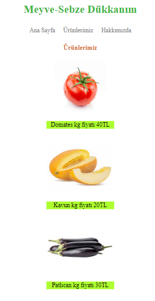

# CSS İlk Proje

Bu projede patika.dev eğitim platformunda öğrendiğim CSS ve HTML bilgilerimle ilk projemi yaptım.

Projede ağırlıklı olarak external css kullandım. Sadece product.html sayfasında class yapısıyla birlikte internal css kullandım. 

index.html:

product.html:

about-us.html:

