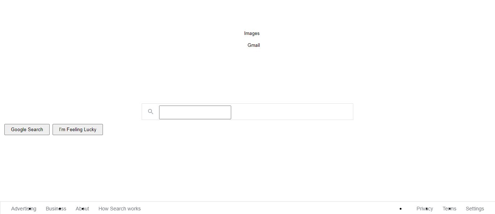
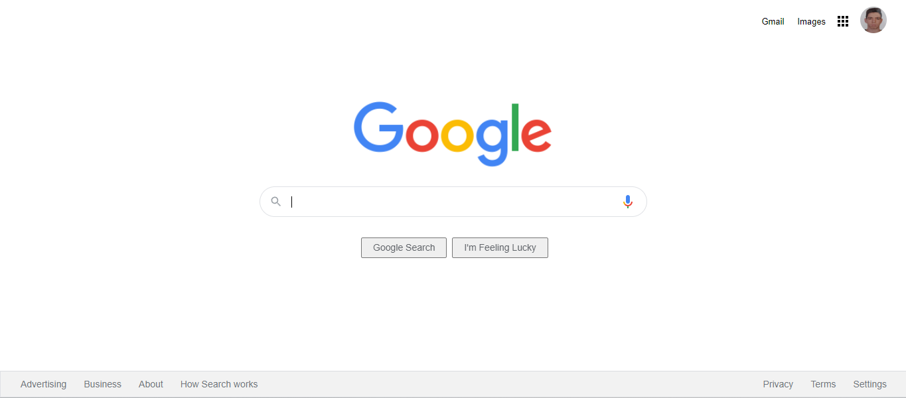

# İkinci Google Clone Çalışması

İlk yaptığım google clone çalışmasına bakmak için [buraya tıklayın.](https://github.com/AliBerkayCelik/Kodluyoruz-FrontEnd-Training/tree/main/CSS-google-clone)

Bu çalışmamada google sayfasının günümüzdeki halini yapmaya çalıştım.

Bu projede karmaşık ve hazır olarak gelen CSS ve HTML dosylarını projeme entegre ettikten sonra düzenlemlerini yaptım. 

### Hazır olarak gelen sayfa örneği :

### Düzenlemlerini yaptıktan sonra sayfanın son hali :

